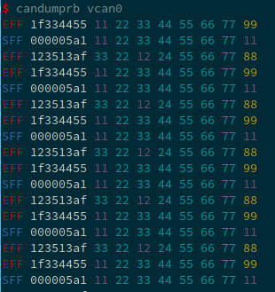

[](https://crates.io/crates/canutils)
[](https://travis-ci.org/marcelbuesing/canutils-rs)
[](https://docs.rs/canutils)

# Binary Installation

```
cargo install --examples canutils
```

# Candumprb

A colorful candump version.

Run via:
```
candumprb vcan0
```

