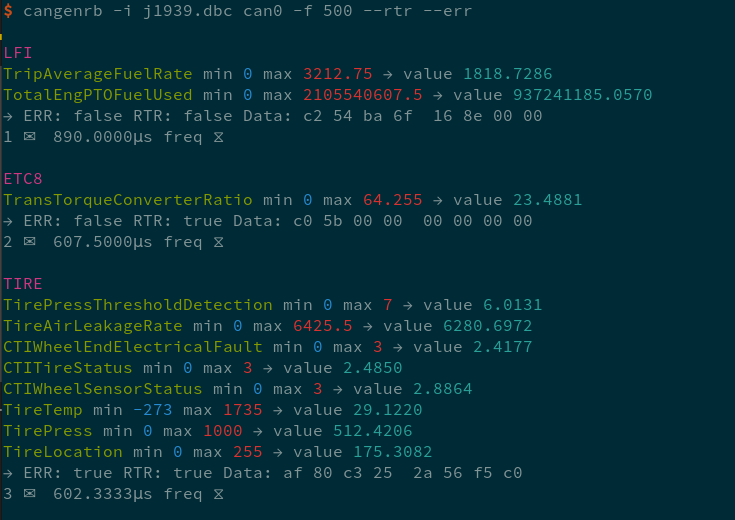

[](https://crates.io/crates/canutils)
[](https://travis-ci.org/marcelbuesing/canutils-rs)
[](https://docs.rs/canutils)

# Binary Installation

```
cargo install --examples canutils
```

# Candumprb

A colorful candump version.


## Interface

```
$ candumprb --help
candumprb 1.0.0
Candump Rainbow. A colorful can dump tool with dbc support.

USAGE:
    candumprb [OPTIONS] <can-interface>

FLAGS:
    -h, --help       Prints help information
    -V, --version    Prints version information

OPTIONS:
    -i, --input <input>    DBC file path, if not passed frame signals are not decoded

ARGS:
    <can-interface>    socketcan CAN interface e.g. vcan0
```

# Cangenrb

A colorful can frame generator that takes a DBC file as input for generating CAN frames. The random values of can signals are, by default, generated within the range specified in the DBC file. To create completely random frame payloads pass the --random-frame-data flag.



## Interface

```
$ cangenrb --help
cangenrb 1.0.0
Cangen Rainbow. A colorful that generates CAN messages based on a supplied DBC file.

USAGE:
    cangenrb [FLAGS] [OPTIONS] <CAN_INTERFACE> --input <input>

FLAGS:
        --err                  Send random error frames
    -h, --help                 Prints help information
    -r, --random-frame-data    Completely random frame data, unrelated to any signal
        --rtr                  Send random remote transmission frames
    -V, --version              Prints version information

OPTIONS:
    -f, --frequency <frequency>        Frequency of sending in microseconds [default: 100000]
    -i, --input <input>                DBC file path
        --transmitter <transmitter>    Only generate messages of the given transmitter (sending node)

ARGS:
    <CAN_INTERFACE>    Only generate messages for the given receiver (receiving node)
```
# Canstatsrb

A tool that collects statistics about received frames and the messages by message id.

## Interface
```
canstatsrb 1.0.0
SocketCAN message statistics

USAGE:
    canstatsrb <can-interface>

FLAGS:
    -h, --help       Prints help information
    -V, --version    Prints version information

ARGS:
    <can-interface>    socketcan CAN interface e.g. vcan0
```

## Output Example
```
RX Total: 6410
EFF Total: 3697	ERR: 0	RTR: 0
SFF Total: 2713	ERR: 0	RTR: 0
Messages by CAN ID
    32     → #  107
   113     → #  93
   152     → #  95
   161     → #  99
   163     → #  95
   290     → #  115
   341     → #  85
   367     → #  83
   383     → #  104
   489     → #  92
   504     → #  94
   548     → #  107
   549     → #  111
   626     → #  88
```